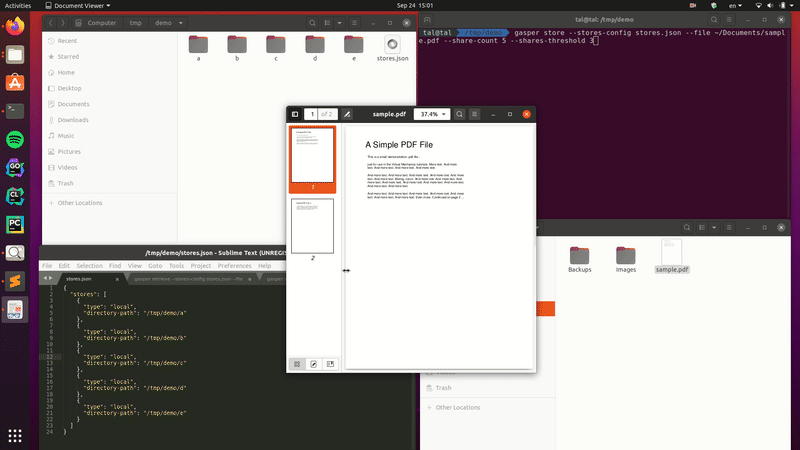

<p align="center">
  
</p>


# Gasper


Back-up & encrypt your files in a distributed manner, across multiple stores of your choice, by splitting them to shares. 
Retrieve them at any point, with only a minimum number of shares required for retrieval.

Each file is being split to multiple shares, all of which are distributed to different destinations defined by you (be it AWS S3, Dropbox, Google Drive, your local filesystem, FTP Server, etc...). You can retrieve your file at any given moment, even if you only have access to a part of the stores you originally used (down to a minimium threshold of your choice). 

Gasper is based on the awesome [Shamir's Secret Sharing algorithm](https://en.wikipedia.org/wiki/Shamir%27s_Secret_Sharing). 

<p align="center">
  
	Source: <a href="http://robinsnippet.blogspot.com/2017/12/shamirs-secret-sharing-scheme.html">Robin's Snippet blog</a>
</p>

# Demo
#### Using local store


## Supported stores

| Type              | Description           | Attributes                |
| ----------------- |-----------------------| --------------------------|
| `local`      | Store share in a local directory | `directory-path` (string) |

Feel free to contribute your own stores - S3, Google Drive, Twitter, FTP, or anything else you'd like :)

### Adding a new store
1. Implement the `Store` interface (`pkg/storage/stores/store.go`):

```
// Store lets you store shares.
type Store interface {
	// Store name.
	Type() string

	// Is store available?
	// Useful especially for remote stores, such as ftp servers or s3 buckets.
	Available() (bool, error)

	// Puts a share in store.
	Put(share *shares.Share) error

	// Retrieves a share from store.
	// If no share with the given File ID exists, returns ErrShareNotExists.
	Get(fileID string) (*shares.Share, error)

	// Deletes a share from store.
	// If no share with the given File ID exists, returns ErrShareNotExists.
	Delete(fileID string) error
}
```
2. Add it to the stores factory function `FromConfig()` (`pkg/storage/stores/factory.go`), so it can be used out-of-the-box in the CLI.
3. Enjoy!

For an example, see `pkg/storage/stores/local.go`.

## Installation
```
go get -u github.com/talhof8/gasper
```

## Usage
#### Store
```
gasper store --stores-config </path/to/stores.json> --file <file> [--encrypt --salt <valid-aes-salt> --share-count <count> --shares-threshold <min-threshold> --verbose]
```
Outputs file ID and checksum on success which should be used for retrieval.

#### Retrieve
```
gasper retrieve --stores-config </path/to/stores.json> --file-id <file-id> --destination <some-destination> [--checksum <some-checksum> --encrypt --salt <valid-aes-salt> --verbose]
```

#### Delete
Best effort deletion.
```
gasper delete --stores-config </path/to/stores.json> --file-id <file-id> [--verbose]
```

Stores configuration file:
```
{
  "stores": [
    {
      "type": "<type>",
      "<attribute>": "<value>",
      "<attribute>": "<value>",
      "<attribute>": "<value>"
    },
    {
      "type": "<type>",
      "<attribute>": "<value>",
      ...
    }
  ]
}
```

## License
Gasper is released under GPL. See LICENSE.txt.
